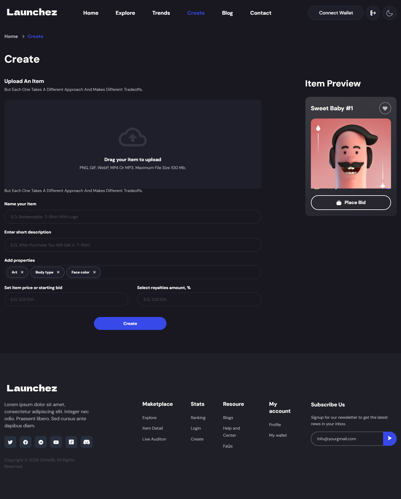
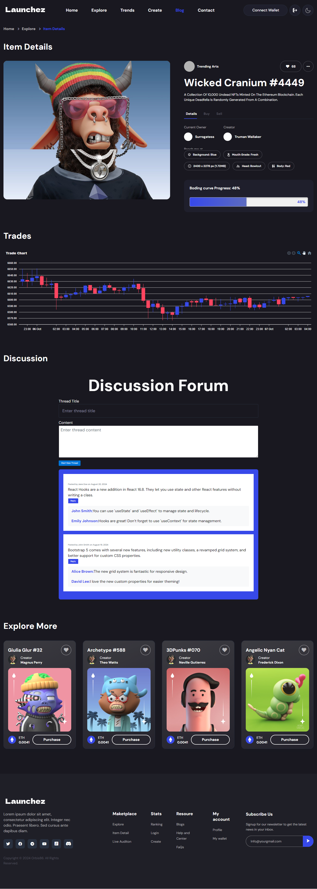
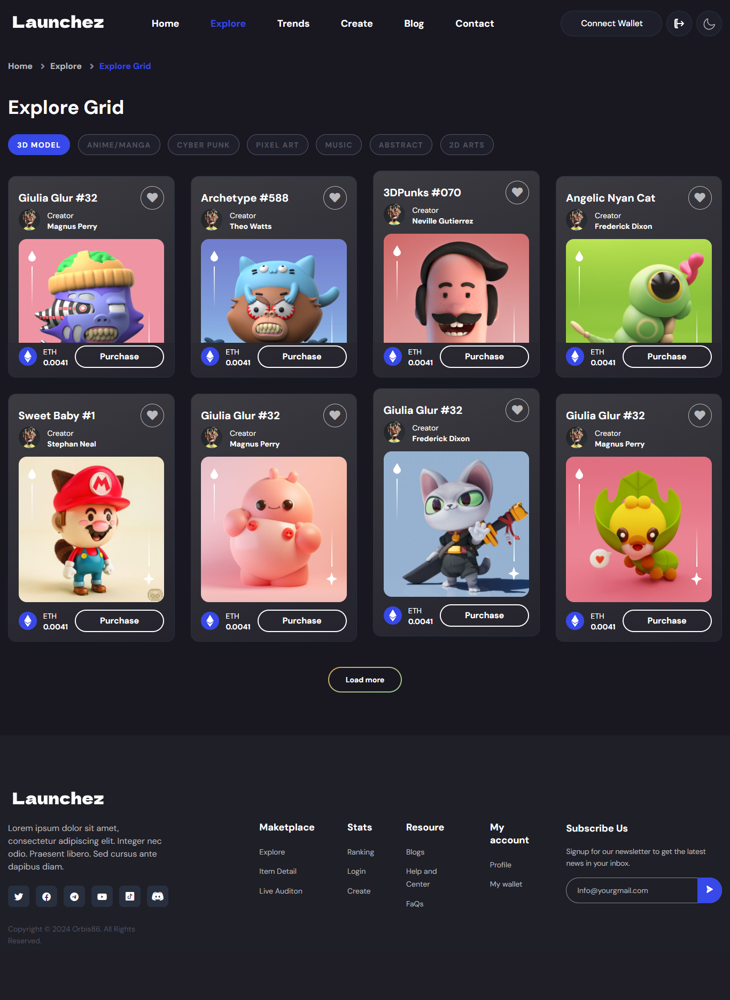

# Launchez

Launchez - A Fair Launch Dapp for launching ERC-20 tokens.

- A cost-effective solution where users can create tokens within the platform in a few clicks for a nominal fee.
- A fair launch is secured by deploying the token on a bonding curve with a constant product formula.
- Liquidity pools are created on SaucerSwap when the token reaches a market cap threshold.

### Innovation

- Launchez is built on Hedera, making the best use of DeFi by enabling a platform to create ERC-20 tokens and launch them fairly.
- The project is new to Hedera; no such solution currently exists.
- The memecoin market, directly coupled with trading volume, has the potential to boost a large volume of daily transactions.
  
### Integration - Works Best with Hedera

- High throughput and low latency with finality provide fast and secure transactions for traders.
- Low and predictable fees enable high trading volumes on Launchez, increasing Hedera’s TPS.
- The project uses HTS for Token creation and HSCS, primarily built with the Hedera SDK with a few functionalities limited to contracts.
- Liquidity pools are deployed on SaucerSwap - a DEX on Hedera.

### Feasibility with Hedera

- The business model revolves around collecting minimal fees for token creation and trading on the bonding curve.
- Launchez addresses a unique Web3 problem by combating scam tokens and rug pulls.

### Execution & Team

- Launchez is currently a fully functional MVP showcasing token creation and buy/sell features on the bonding curve, implemented using the Hedera SDK.
- Features to increase community engagement, such as comments and spaces, are to be developed according to the roadmap.
- Soniya, the founder of Orbis86, led the team as Product Manager, while Hema (Smart Contract Developer & Partnership Manager), Alex (Full Stack Developer), and Dishit (Front-End Developer) worked together on product development.

### Validation with Orbis Community

- The product idea was refined through feedback from the Orbis86 community, which is very active on Hedera.
- Feedback highlighted the lack of a meme-coin launch dapp with an easy interface, currently unavailable on Hedera.
- There is potential to attract degens to the Hedera ecosystem through this project.
- The project has been welcomed by SMEs of the trading community, with encouragement to add a commenting feature, which has been added to our pipeline.

### Product Launch & Success

- We are confident that Launchez will have a highly positive impact on the Hedera ecosystem.
- The project encourages new token deployment and boosts account creation.
- Launchez also increases monthly active users with constant trading and FOMO due to the bonding curve's nature, incentivizing the purchase of tokens at lower prices.
- With active trading, we believe Launchez will increase TPS and attract new users and degens to Hedera.

### Pitch Deck

[Pitch Deck](https://www.canva.com/design/DAGNj4UtZJ4/E7jyf6nhY2mQgIp4kBSiww/edit?utm_content=DAGNj4UtZJ4&utm_campaign=designshare&utm_medium=link2&utm_source=sharebutton)

### Screenshots

