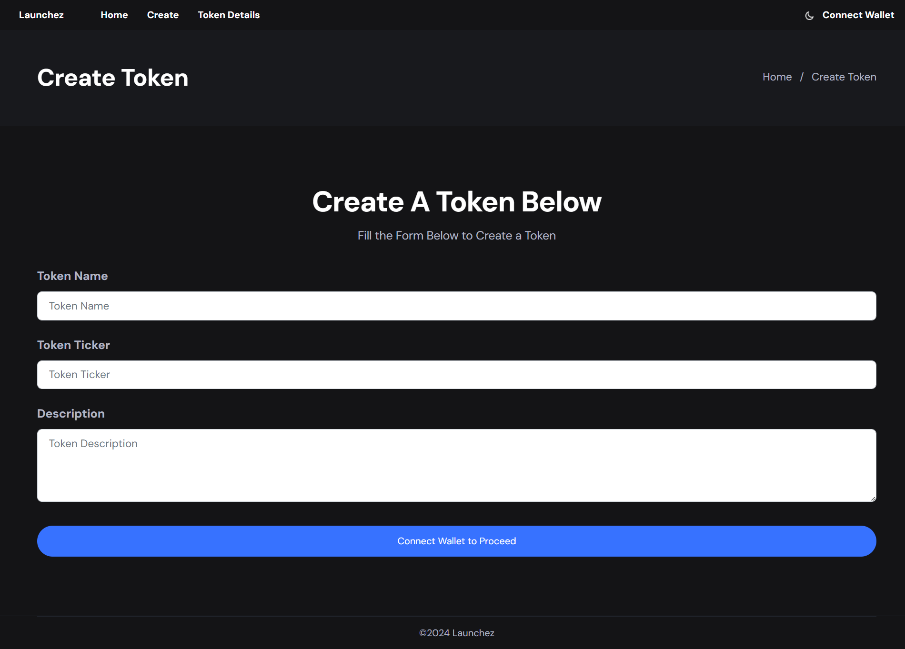
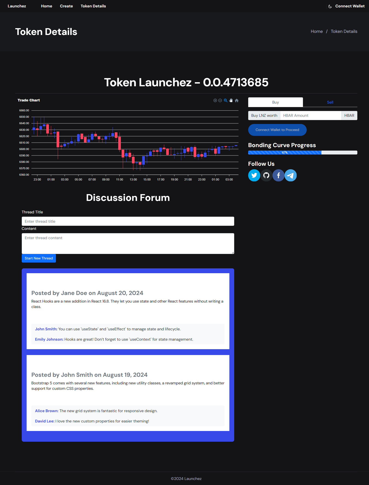
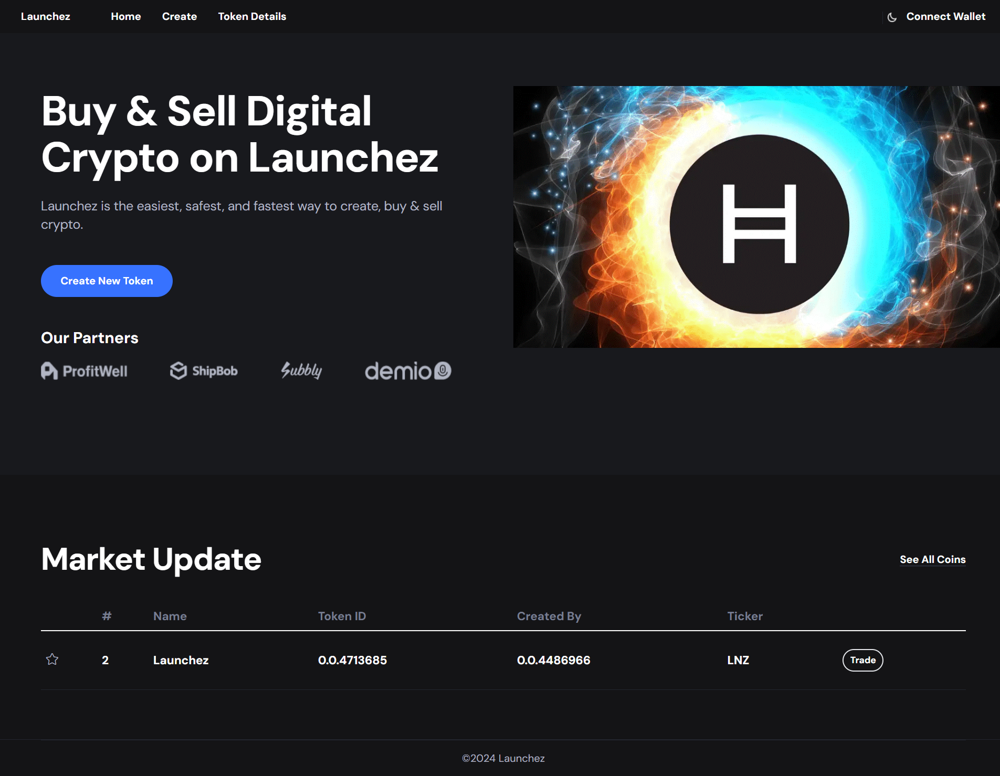

# Launchez

Launchez - A Fair Launch Dapp for launching ERC-20 tokens.

- A cost-effective solution where users can create tokens within the platform in a few clicks for a nominal fee.
- A fair launch is secured by deploying the token on a bonding curve with a constant product formula.
- Liquidity pools are created on SaucerSwap when the token reaches a market cap threshold.

### Innovation

- Launchez is built on Hedera, making the best use of DeFi by enabling a platform to create ERC-20 tokens and launch them fairly.
- The project is new to Hedera; no such solution currently exists.
- The memecoin market, directly coupled with trading volume, has the potential to boost a large volume of daily transactions.
  
### Integration - Works Best with Hedera

- High throughput and low latency with finality provide fast and secure transactions for traders.
- Low and predictable fees enable high trading volumes on Launchez, increasing Hedera’s TPS.
- The project uses HTS for Token creation and HSCS, primarily built with the Hedera SDK with a few functionalities limited to contracts.
- Liquidity pools are deployed on SaucerSwap - a DEX on Hedera.

### Feasibility with Hedera

- The business model revolves around collecting minimal fees for token creation and trading on the bonding curve.
- Launchez addresses a unique Web3 problem by combating scam tokens and rug pulls.

### Execution & Team

- Launchez is currently a fully functional MVP showcasing token creation and buy/sell features on the bonding curve, implemented using the Hedera SDK.
- Features to increase community engagement, such as comments and spaces, are to be developed according to the roadmap.
- Soniya, the founder of Orbis86, led the team as Product Manager, while Hema (Smart Contract Developer & Partnership Manager), Pratishtha (Smart Contract Developer), Alex (Full Stack Developer Advisor) worked together on product development.

### Validation with Orbis86 Community

- The product idea was refined through feedback from the Orbis86 community, which is very active on Hedera.
- Feedback highlighted the lack of a meme-coin/fungible token launch dapp with an easy interface, currently unavailable on Hedera.
- There is potential to attract degens to the Hedera ecosystem through this project.
- The project has been welcomed by SMEs of the trading community, with encouragement to add a commenting feature, which has been added to our pipeline.

### Product Launch & Success

- We are confident that Launchez will have a highly positive impact on the Hedera ecosystem.
- The project encourages new token deployment and boosts account creation.
- Launchez also increases monthly active users with constant trading and FOMO due to the bonding curve's nature, incentivizing the purchase of tokens at lower prices.
- With active trading, we believe Launchez will increase TPS and attract new users and degens to Hedera.

### Pitch Deck

[Pitch Deck](https://www.canva.com/design/DAGOcUhXGgA/pfILKZtMFMoRyPZYJUhFxA/view?utm_content=DAGOcUhXGgA&utm_campaign=designshare&utm_medium=link&utm_source=editor)

## Bonding Curve

The bonding curve allows users to buy tokens on Launchez based on virtual collateral and token reserves. Once the market cap of a token reaches at least ~719,550 Hbar or 80%+ tokens are sold on the bonding curve, the token will be migrated to SaucerSwap and LP tokens received from SaucerSwap will be sent to a burner contract to lock them forever.

### Token Supply and Fair Launch Principles

- Every token X launched on Launchez will have a fixed supply of 700 Million tokens with no special allocations set aside for developer, advisors, investors, etc.
- Once a token reaches a market cap of ~719k Hbar aka 80%+ tokens are sold, the token will be migrated to Saucerswap. A liquidity pool will be created and the LP tokens will be locked forever in a smart contract.

### Bonding Curve Formula
For any token X,

k = va * vb
where
k is a constant
va = virtual token X supply
vb = virtual hBar collateral

### Initial Values
va = 720,000,000 virtual token X supply
vb = 34,300 virtual hbar collateral
Price of token X at launch (p0) = vb/va

### Fees
- Fees collected when creating token X = 50 hbar + gas fees
- Transaction fees for Bonding Curve trades = 2%
- Fees to deploy Liquidity Pool on Saucerswap = 5000 Hbar (Deducted from the collateral collected and includes 50 USD fee to be paid to Saucerswap for creation of a Liquidity Pool)

### Migration to Saucerswap

When 80%+ tokens are sold on the bonding curve, a liquidity pool will be created on Saucerswap
Approximate Hbar in the Liquidity pool = 120,000+ Hbar
Approximate tokens in the Liquidity pool = Lesser than 135 Million tokens

#### Calculations for Liquidity Pool
Final price at migration (p1) = (vb + collateral collected in Hbar)/(va - token X sold on the bonding curve)
Tokens to migrate (M) = (Collateral collected in hbar - 5000 hbar fees)/p1
Tokens to burn by locking away in smart contract = 700,000,000 - M - Total tokens sold on the bonding curve

## Screenshots

